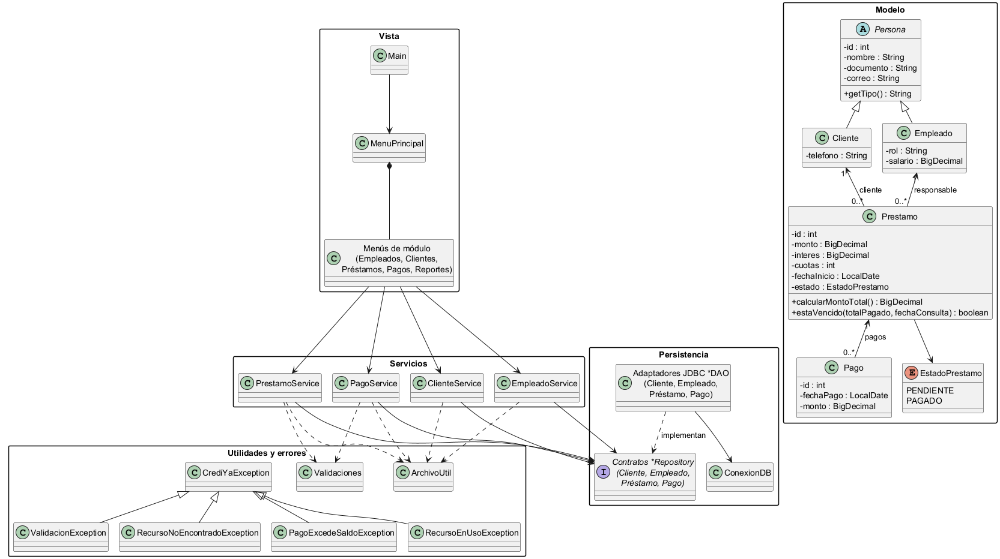

# CrediYa - Sistema de cartera

Aplicación de consola Java para administrar empleados, clientes, préstamos y pagos. MySQL es la fuente principal de datos. Los archivos `data/*.txt` son respaldos reconstruibles que se actualizan después de cada escritura confirmada en la base.

## Requisitos

- JDK 17 o posterior.
- Maven 3.8 o posterior.
- MySQL 8.0 o posterior.

El proyecto apunta a Java 17: los text blocks están disponibles desde Java 15 y `Stream.toList()` desde Java 16; el código no requiere Java 25.

## Preparar MySQL

1. Ejecutar [`sql/crediya_db.sql`](sql/crediya_db.sql) en MySQL. El script crea el esquema e inserta o actualiza datos de demostración; no elimina registros adicionales.
2. Configurar la conexión con variables de entorno. El URL por defecto es `jdbc:mysql://localhost:3306/crediya_db`, el usuario por defecto `root` y la contraseña por defecto vacía.

En PowerShell:

```powershell
$env:CREDIYA_DB_URL = "jdbc:mysql://localhost:3306/crediya_db"
$env:CREDIYA_DB_USER = "root"
$env:CREDIYA_DB_PASSWORD = "tu-clave-local"
```

En Linux/macOS:

```sh
export CREDIYA_DB_URL="jdbc:mysql://localhost:3306/crediya_db"
export CREDIYA_DB_USER="root"
export CREDIYA_DB_PASSWORD="tu-clave-local"
```

No guardes contraseñas reales en el código ni en archivos versionados. `CREATE TABLE IF NOT EXISTS` no altera tablas antiguas: comprueba que tengan las columnas, índices y restricciones definidas en el script.

## Ejecutar

Desde la raíz del proyecto:

```sh
mvn clean verify
mvn exec:java -Dexec.mainClass=com.alejotech.crediya.Main
```

La base debe estar accesible al iniciar la aplicación. `Main` construye los servicios y delega la interacción a `vista/MenuPrincipal`; al iniciar también reconstruye los respaldos de texto desde MySQL.

En el menú principal, “Consultar respaldos en archivos” permite leer individualmente los cuatro `data/*.txt` o mostrarlos todos. Los archivos se usan como consulta/exportación, no como una vía de restauración a MySQL.

## Ejemplo de salida

Con los datos incluidos en el script SQL y la fecha de ejemplo 5 de octubre de 2026, el menú ofrece las opciones:

```text
========== REPORTES ==========
1. Préstamos activos (pendientes)
2. Préstamos pagados
3. Préstamos superiores a $1.000.000
4. Préstamos con cuotas vencidas (en mora)
5. Clientes con préstamos
6. Clientes morosos
7. Total prestado por empleado
8. Saldo total de cartera
9. Recaudo por cliente
10. Personas (polimorfismo)
11. Volver
Seleccione una opción:
```

En el menú principal se puede elegir `6. Consultar respaldos en archivos` y después `5. Todos` para leer los registros guardados en los cuatro archivos de `data/`.

El reporte de cartera muestra los agregados calculados a partir de los préstamos y pagos:

```text
--- TOTAL PRESTADO POR EMPLEADO ---
Ana Torres: $1300000.00
Luis Rojas: $500000.00

Saldo total de cartera: $1265000.00

--- RECAUDO POR CLIENTE ---
Laura Gómez: $150000.00
David Pérez: $510000.00
```

Los importes dependen de los datos vigentes de MySQL y pueden cambiar al registrar pagos o préstamos.

Los reportes usan Stream API para filtrar y transformar datos; `groupingBy` con sumas de `BigDecimal` agrupa el capital por empleado y los pagos por cliente. Los totales también muestran empleados y clientes sin actividad con valor cero.

## Reglas de negocio

- El interés es simple sobre el capital. `Prestamo.calcularMontoTotal` es la implementación única del cálculo y redondea a dos decimales.
- La cuota mensual es el total dividido por las cuotas, redondeado a dos decimales.
- `EstadoPrestamo` modela los estados `PENDIENTE` y `PAGADO`; el acceso JDBC convierte el enum a texto solo al persistirlo.
- Cada préstamo nuevo comienza como `PENDIENTE`; su estado no se puede fijar como pagado antes de que existan abonos que cubran el total.
- Un préstamo está en mora si ya venció una o más cuotas mensuales y los pagos acumulados no cubren el valor esperado para esas cuotas. El reporte consulta los pagos agrupados en una sola operación, no una consulta por préstamo.
- Registrar o eliminar un pago recalcula y persiste el estado del préstamo dentro de una transacción. La acción de “cambiar estado” solo permite corregir el estado para que refleje el saldo; no permite marcar como pagado un préstamo con deuda ni como pendiente uno saldado.
- Los respaldos `.txt` se escriben desde datos confirmados en MySQL, no se importan al arrancar. Esta decisión evita tomar archivos editables/desactualizados como fuente de verdad y evita restauraciones parciales que violen relaciones o dupliquen registros. Si la base se pierde, debe restaurarse desde su propia copia de seguridad; los `.txt` son respaldo de lectura humana, no una exportación de restauración transaccional.
- El vencimiento se estima por meses desde `fecha_inicio`; no se almacenan fechas individuales de vencimiento por cuota.

## Arquitectura y UML

El proyecto tuvo tres interfaces de consola porque fue acumulando implementaciones sucesivas: la consola monolítica dentro de `Main`, una segunda versión en `MenuConsola` y los menús separados de `vista/`. La aplicación ahora usa únicamente `vista/`; se eliminaron los dos menús históricos para no mantener implementaciones divergentes. `Main` solo crea los servicios, sincroniza los respaldos y abre el menú principal.

Las interfaces `*Repository` declaran los contratos de persistencia y las clases `*DAO` son sus adaptadores JDBC concretos. Se conserva esa distinción para que los servicios dependan de contratos y puedan probarse con implementaciones sustitutas.



El archivo fuente editable es [`docs/UML_CrediYa.puml`](docs/UML_CrediYa.puml).

## Estructura del proyecto

```text
Proyecto_Java/
|-- data/                              Respaldos de texto consultables
|-- docs/
|   |-- CrediYa_Arquitectura.drawio    Diagrama editable de flujo y tablas
|   |-- UML_CrediYa.puml               Fuente del diagrama de clases
|   `-- UML_CrediYa.png                UML exportado para visualizar
|-- sql/
|   `-- crediya_db.sql                 Esquema MySQL y datos de demostración
|-- src/
|   |-- main/java/com/alejotech/crediya/
|   |   |-- conexion/                  Configuración y apertura JDBC
|   |   |-- dao/                       Contratos Repository y adaptadores DAO
|   |   |-- excepciones/               Excepciones de negocio tipadas
|   |   |-- modelo/                    Entidades, enum y reglas de dominio
|   |   |-- service/                   Validaciones y casos de uso
|   |   |-- util/                      Archivos, entrada y validaciones comunes
|   |   |-- vista/                     Menús de consola por módulo
|   |   `-- Main.java                  Punto de entrada de la aplicación
|   `-- test/java/                     Pruebas unitarias y de consola
|-- .gitignore
|-- pom.xml                            Java 17, MySQL Connector/J y JUnit 5
`-- README.md
```

### Cómo funciona

1. `Main` crea los servicios y la vista principal.
2. La vista solicita datos al usuario y delega cada acción al servicio correspondiente.
3. Los servicios aplican validaciones y reglas del dominio; los errores se expresan con excepciones y la vista muestra el mensaje.
4. Los servicios usan interfaces `*Repository`; las implementaciones `*DAO` ejecutan SQL con JDBC y `PreparedStatement`.
5. Al registrar o modificar datos, primero se confirma la operación en MySQL. Después el servicio vuelve a escribir el archivo de respaldo correspondiente mediante una sustitución atómica.
6. La opción “Consultar respaldos en archivos” lee los `.txt` mediante `ArchivoUtil`; los archivos no se importan ni se usan para restaurar la base.
7. Los reportes usan streams para filtrar y agrupar; los totales de pagos por préstamo se consultan en bloque para calcular mora sin una consulta SQL por préstamo.

### Diagrama editable en draw.io

El archivo [`docs/CrediYa_Arquitectura.drawio`](docs/CrediYa_Arquitectura.drawio) se puede abrir y editar en [diagrams.net (draw.io)](https://app.diagrams.net/) con **File > Open From > Device**. Incluye el recorrido consola → vista → servicio → repositorio/DAO → MySQL, el uso de los respaldos de texto y el modelo entidad-relación de la base.

| Tabla | Atributos | Claves y relaciones |
|---|---|---|
| `empleados` | `id`, `nombre`, `documento`, `rol`, `correo`, `salario` | `id` es PK; `documento` es único. Un empleado puede gestionar cero o muchos préstamos. |
| `clientes` | `id`, `nombre`, `documento`, `correo`, `telefono` | `id` es PK; `documento` es único. Un cliente puede tener cero o muchos préstamos. |
| `prestamos` | `id`, `cliente_id`, `empleado_id`, `monto`, `interes`, `cuotas`, `fecha_inicio`, `estado` | `id` es PK; `cliente_id` y `empleado_id` son FK. Cada préstamo pertenece a un cliente y a un empleado; puede tener cero o muchos pagos. |
| `pagos` | `id`, `prestamo_id`, `fecha_pago`, `monto` | `id` es PK; `prestamo_id` es FK. Cada pago pertenece a un préstamo. |

Las relaciones del esquema son `clientes 1:N prestamos`, `empleados 1:N prestamos` y `prestamos 1:N pagos`; las claves foráneas impiden borrar registros padre mientras tengan registros dependientes.

## Pruebas

Verificación automatizada ejecutada en el proyecto:

```sh
mvn clean verify
```

Resultado de la última ejecución: **14 pruebas, 0 fallos y 0 errores**. Maven compiló las 35 clases de producción y las 6 clases de prueba con `--release 17`, ejecutó Surefire y completó `verify`.

| Suite | Casos | Qué comprueba |
|---|---:|---|
| `PrestamoTest` | 3 | Interés simple, redondeo, cuota mensual y mora según cuotas esperadas. |
| `PagoServiceTest` | 2 | Rechazo de un abono superior al saldo y de pagos con fecha futura; confirma que no se persiste el pago inválido. |
| `PrestamoServiceTest` | 3 | Rechazo de estado pagado si hay saldo, rechazo de préstamo sin cliente e inicio obligatorio en estado pendiente. |
| `ArchivoUtilTest` | 2 | Escritura/lectura del respaldo, escape de separadores y rechazo de rutas fuera de `data/`. |
| `ValidacionesTest` | 3 | Formatos de correo/documento/teléfono, montos, límites de longitud y precisión. |
| `MenuPrincipalTest` | 1 | Construcción del menú y salida limpia sin abrir una conexión JDBC. |

Las pruebas de servicios usan repositorios sustitutos; por tanto, **no simulan ni sustituyen una prueba de integración con MySQL**. Para comprobar JDBC en el equipo de entrega, configura las variables de entorno de la sección MySQL, ejecuta `mvn exec:java -Dexec.mainClass=com.alejotech.crediya.Main` y verifica el listado de empleados/clientes, creación de un préstamo, registro de un pago, saldo e historial. También revisa `data/` después de una escritura exitosa. No se incluye una prueba automatizada que modifique una base real para evitar alterar datos del usuario.
